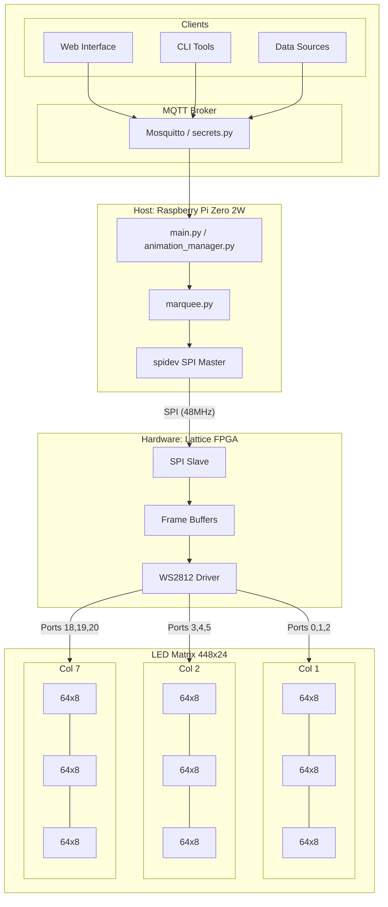

# py_marquee

A Python-based controller for driving a large-scale WS2812 LED matrix, designed to run on a **Raspberry Pi Zero 2W**. It communicates with a hardware-accelerated [ws2812_driver](../ws2812_driver) running on a Lattice FPGA via SPI.

## Overview

This project manages a high-resolution LED matrix by offloading the timing-critical WS2812 signal generation to an FPGA. The Python code handles:
- **Matrix Management:** Organizing multiple 64x8 LED segments into a large unified display (e.g., a 448x24 grid).
- **Font Rendering:** Drawing text using custom 5x8 fonts.
- **Animations:** Managing dynamic content and transitions.
- **MQTT Integration:** Remote control and data display (e.g., weather, clock, notifications).
- **Web Interface:** (Optional) For configuration and status.

## Hardware Architecture

The system uses a Raspberry Pi Zero 2W as the primary controller. It sends pixel updates over SPI to a Lattice MachXO2/3 FPGA, which acts as a multi-channel WS2812 driver.

### Layout



## Software Structure

- `neomatrix/`: Core matrix logic, including coordinate mapping (`xy2i`) and SPI packet construction.
- `marquee/`: High-level board management, coordinating multiple matrix segments.
- `templates/`: Display modules for different functions (Clock, Weather, Timer, etc.).
- `animation_manager.py`: Handles the timing and execution of animations.
- `mqtt_handlers.py`: Processes incoming MQTT messages to update the display.

## Interaction with FPGA

The `matrix.py` module constructs 5-byte SPI packets for each pixel update:
`[Control/Port] [Address High/Low] [Green] [Blue] [Red]`

The Raspberry Pi uses the `spidev` library to transmit these packets at high speed (up to 48MHz) to the FPGA, ensuring smooth animations even on very large matrices.

## Setup and Installation

1. **Dependencies:** Install required Python libraries:
   ```bash
   pip install -r requirements.txt
   ```
2. **Configuration:** Update `secrets.py` with your MQTT and WiFi credentials.
3. **Service:** A systemd service file (`marquee.service`) is provided to run the driver on boot.
